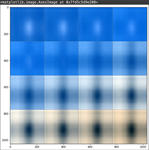

I spent a lot of time making cyanotypes during COVID-19. Cyanotypes are photographic images made by coating a paper with an iron mixture and exposing it to UV light. The paper is then bathed in water and turns a rich blue as it oxidizes. Any opaque material left on the paper will appear as a white outline. 

The cyanotypes used in this project were made with leaves from an orange tree.

Images are first loaded in from Google Drive and displayed.

Images are normalized. Then, using numpy, a mean image is calculated and displayed along with -3 and +3 standard deviations.

An InceptionV3 model is loaded from TensorFlow. Activations are obtained from this model. Predictions for these activations are then converted into a numpy array and printed. 'Head cabbage' is the most frequent prediction, probably because the venation of the leaves shown in the cyanotype are a common structure for plant life.

Features are extracted from the activations and printed.

The extracted features are then reduced to two dimensions using PCA, t-SNE, and UMAP techniques. Then, the features are plotted.

Images for each point are visualized. One can roughly make out two clusters of images, with one focusing on the center of the cyanotypes wear the venation is dense and the other cluster collecting parts of the image that include the edges of the paper.

A grid is created spanning the range of values of the 2D projected features. The features are assigned to a position on the grid and visualized.

The resulting grid is displayed with the assigned images. The clusters a little more legible now. With cyanotypes, darker images often correspond to a longer exposure time and lighter images the opposite; the length of exposure is also more observable in this arrangement, with the images getting darker from left to right and bottom to top.

Lastly, seaborn is used to plot a bivariate distribution of the features. 

